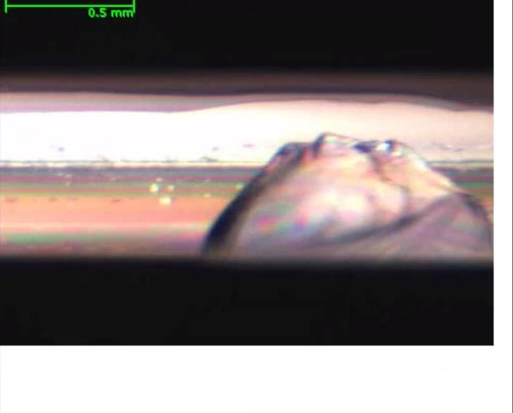
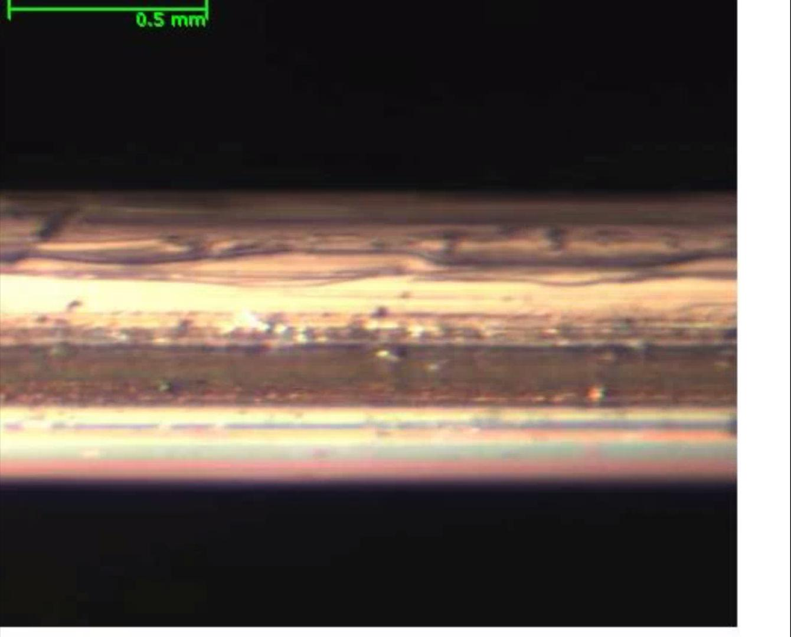

# CNN for Wafer Edge ADC
#### An ML Model Deployment UI MVP
##### [View WebApp Here](https://share.streamlit.io/zhermin/ssmc "My Machine Learning WebApp")
*Note: There is a Demo Mode setup in the webapp if you are an external viewer but still want to take a look*  

---

## Description

This is a webapp that I wrote to showcase a simple UI for my trained machine learning models during my internship at SSMC. My project was to create an automatic defect classification (ADC) system that can differentiate between a wafer image with chipping (left, a defect) or not (right, normal wafer). 

 

After training the models using libraries Tensorflow and Keras and using transfer learning with convolutional neural network models such as VGG16 and MobileNetV2, the models are able to achieve >99% out of sample accuracy. 

Hence, in order for users to utilize these trained models without integration with company infrastructure, I built this webapp using Python's Streamlit library and hosted on Streamlit's servers for free as an MVP to allow users to upload wafer scans and observe the results quickly to see the business value of my solutions. 

---

## Features

* Upload up to 500 (recommended) images at a time for prediction
* Settings at the Left Sidebar
    * Select a trained model - they vary in accuracy and speed depending on the backbone (eg. VGG16, MobileNetV2, etc.)
    * Select the percent threshold that predictions must meet to be considered a 'confident' prediction
    * Select the number of images per row and per page and toggle image names for best viewing experience
* Sort by a particular column by clicking on the column name in a table
* For None predictions, jump to pages if there are a lot of predictions (press Enter after typing a page number and click 'GO') or use the Prev/Next buttons to navigate
* Buttons above every table to download as CSV (Excel-readable file)
* Quick summary table to highlight the lot IDs and wafer IDs with chipping images